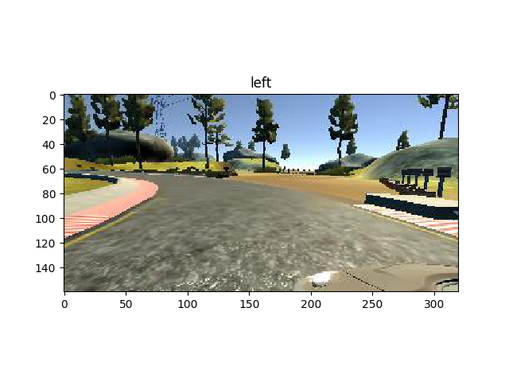

#**Behavioral Cloning** 

This project **Behavioral Cloning** is done as a part of [selfdriving car Engineer NanoDegree]((https://www.udacity.com/drive) from udacity.

---

**Behavioral Cloning Project**

The approach follwed in this project is as follows:
* Use the [Udacity driving simulator](https://github.com/udacity/self-driving-car-sim) to collect data of good driving behavior, I have use the driving data given by udacity in the class.
* Desgined a neural network in Keras that predicts steering angles from images
* Trained and validated the model with a training and validation set (this is the split from the original dataset)
* Tested the model in the simulator for driving a complete lap.

## Pre processing

**processData.py**s has all the helper functions to pre process the images and data generators to yield the data for training and validation.
**key point here is to pre process the images**

The simulator records the three images from left center and right cameras with 10Hz and the corresponding steering angle.
below figures shows the images from three cameras and the steering angle:

Left   | Center | Right
-------|------- |-------
 |  | 

The dataset provided by the udacity in the class has 24108 images (8036 images per camera angle). 

The pre processing pipeline is as follows, we apply 
* *random shear* for 90% of the images (i,e, 0.9 % probability) then 
* *crop* the image, 35% from top and 10% from bottom then
* *flip* the image randomly (i,e with 0.5 probability) and corresponding steering angles are also flipped
* then do the *gamma correction* 
* and finally *resize* the image to 64x64 to reduce the training starin
then the images are fed to the network.

The individual processing techniques are shown on a single image:

shear| crop | flip | gamma| resize
-----|-----|----- | ----- | -----
 |  |  |  | 

below shows one image going through all the processing:

shear| crop | flip | gamma| resize
-----|-----|----- | ----- | -----
 |  |  |  | 

## Network Architecture
**model.py** has the implemented model. the model is atken from [Nvidia End to End learning](https://arxiv.org/pdf/1604.07316.pdf) and the details are given below. 

below shows the summary of model used for training           

Layer (type)                         |    Output Shape     |  Param #  | Connected to    
-------------------------------------|---------------------|---------- | -----------------------
lambda_1 (Lambda)                    | (None, 64, 64, 3)   |  0      |     lambda_input_1[0][0]             
convolution2d_1 (Convolution2D)      | (None, 32, 32, 24) |   1824   |     lambda_1[0][0]                   
activation_1 (Activation)            | (None, 32, 32, 24) |   0     |      convolution2d_1[0][0]            
maxpooling2d_1 (MaxPooling2D)        | (None, 31, 31, 24)  |  0      |     activation_1[0][0]               
convolution2d_2 (Convolution2D)      | (None, 16, 16, 36)  |  21636  |     maxpooling2d_1[0][0]             
activation_2 (Activation)            | (None, 16, 16, 36) |   0       |   convolution2d_2[0][0]            
maxpooling2d_2 (MaxPooling2D)  |  (None, 15, 15, 36)  |  0     |      activation_2[0][0]               
convolution2d_3 (Convolution2D)|  (None, 8, 8, 48)    |  43248   |    maxpooling2d_2[0][0]             
activation_3 (Activation)    |    (None, 8, 8, 48)   |   0      |     convolution2d_3[0][0]            
maxpooling2d_3 (MaxPooling2D)   | (None, 7, 7, 48)  |    0     |      activation_3[0][0]               
convolution2d_4 (Convolution2D) | (None, 7, 7, 64)  |    27712  |     maxpooling2d_3[0][0]             
activation_4 (Activation)    |    (None, 7, 7, 64)   |   0       |    convolution2d_4[0][0]            
maxpooling2d_4 (MaxPooling2D)  |  (None, 6, 6, 64) |     0    |       activation_4[0][0]               
convolution2d_5 (Convolution2D) | (None, 6, 6, 64) |     36928   |    maxpooling2d_4[0][0]           
activation_5 (Activation)   |     (None, 6, 6, 64)  |    0    |       convolution2d_5[0][0]            
maxpooling2d_5 (MaxPooling2D)  |  (None, 5, 5, 64)  |    0       |    activation_5[0][0]               
flatten_1 (Flatten)      |        (None, 1600)    |      0       |    maxpooling2d_5[0][0]           
dense_1 (Dense)            |      (None, 1164)     |     1863564   |  flatten_1[0][0]                 
activation_6 (Activation)     |   (None, 1164)    |      0        |   dense_1[0][0]                   
dense_2 (Dense)            |      (None, 100)        |   116500   |   activation_6[0][0]               
activation_7 (Activation)    |    (None, 100)     |      0         |  dense_2[0][0]                    
dense_3 (Dense)            |      (None, 50)      |     5050     |   activation_7[0][0]               
activation_8 (Activation)    |    (None, 50)   |         0        |   dense_3[0][0]                    
dense_4 (Dense)           |       (None, 10)      |      510     |    activation_8[0][0]               
activation_9 (Activation)      |  (None, 10)       |    0       |    dense_4[0][0]                    
dense_5 (Dense)               |   (None, 1)      |       11    |      activation_9[0][0]               

Total params: 2,116,983
Trainable params: 2,116,983
Non-trainable params: 0

*used pooling layers to reduce the training time*
               
The model is with 2,116,983 params

## Training

**model.py** used *Adam optimizer*, *mean squared error* as loss metric and *1e-4* learning rate. The model is trained for 8 epochs. The model is compiled and saves the architecture as a .json file *(model.json)*.
then trains the model over training data and save the model with weights as .hd file *(model.h5)* and weights as *weights.h5*

Used a batch size of 64 for both traning and validation and used 20000 images per epoch.
Trained the model with different epoch's like 5, 8, 10, 15. 20, 30, 40, 50. but after 12 epochs the accuracy starts decreasing, so fixed with 8 epochs, this gives a sufficiently trained model for the given sample dataset. a kind of [early stopping](https://en.wikipedia.org/wiki/Early_stopping) to reduce over fitting

**note:**Usually dropout layers are used to reduce over fitting, if we use dropout layers in the model during training, these dorpout layers should be removed in the inference mode (while prediticting the steering angle).
 
## Results
Tried different model and also on the self generated dataset, but the results were not satisfactory. The Nvidia model with udacity class provided dataset gave the significant results.

*drive.py* script is given by udacity in class.
Its a kind of ineference, predicts the steering angle using the model with trained weights *(model.hd)*, and these predicted steering commands are given to simulator with constant throttle (with simple PID controller) to drive the car in autonomous mode in simulator.

Since the images were reshaped and cropped during training, the image from the simulator is also reshaped and cropped just as in *processData.py* 

below is the links to the video:
https://www.youtube.com/watch?v=xbbJy47r-F0

## steps to run the code

**Just using the weights and running inference mode**

* `python drive.py model.h5 run1`         
this should use the pre trained weights and the model and predict the steering angle           
* then run the simulator in autonomous mode and the car should be sucessfully driven in the simulator and images hspould be saved in the folder run1

**Training and predicting**

* collect the data and modify the path accordingly in *processData.py*
* `python model.py` loads the pickled data and trains over it and should generate the model *model.json* and the model with weights *model.h5* and weights as *weight.h5*
change the epochs if required
* `python drive.py model.h5 run1`          
this should use the pre trained weights and the model and predict the steering angle             
* then run the simulator in autonomous mode and the car should be sucessfully driven in the simulator and images hspould be saved in the folder run1

